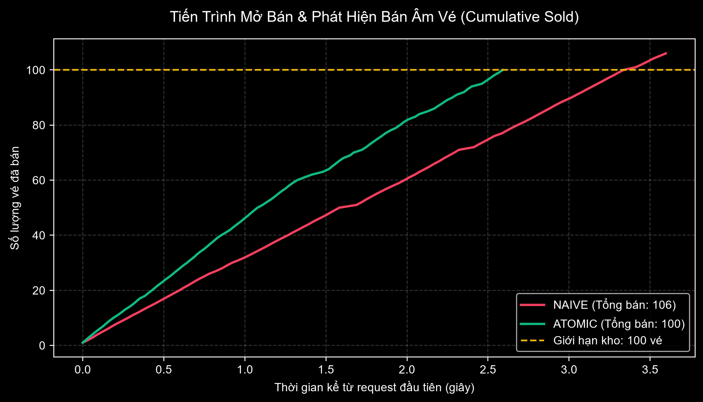
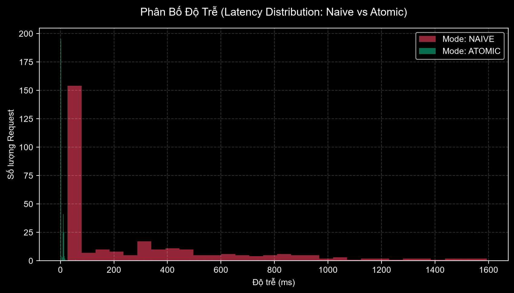

# 🎟️ Flash-Sale Concurrency Engine & Telemetry Lab

[🇻🇳 Tiếng Việt](#-tiếng-việt) • [🇬🇧 English](#-english)

---

<a name="tiếng-việt"></a>
# 🇻🇳 TIẾNG VIỆT

## 💡 Dự Án Này Giải Quyết Bài Toán Gì?

Chắc hẳn bạn từng nghe qua cảnh hàng triệu người tranh nhau săn vé concert BlackPink, Taylor Swift hay săn sale 1k trên Shopee: **web thì lag, vé thì hết trong chớp mắt, và cay đắng nhất là hệ thống báo "mua thành công" nhưng 5 phút sau bị hủy đơn vì... bán lố vé!**

Là sinh viên IT / Khoa học Dữ liệu, mình tò mò: **"Tại sao các hệ thống lớn lại bị lỗi này? Và làm sao để code một hệ thống không bao giờ bị bán âm vé dù bị cả nghìn người bấm mua cùng 1 giây?"**

Dự án này là phòng thí nghiệm (Lab) thực nghiệm đối đầu trực tiếp:
- **Kịch bản 1 (Code kiểu sinh viên thường làm):** Dùng Database truyền thống (SQLite) đọc - kiểm tra - ghi. Kết quả: **BỊ BÁN ÂM VÉ (106/100 vé)**.
- **Kịch bản 2 (Chuẩn thực tế công nghiệp):** Dùng **Redis Atomic** xử lý ngay trên RAM. Kết quả: **CHÍNH XÁC 100/100 VÉ (Zero Oversell)**, độ trễ nhanh hơn **71 lần**.

---

## 🔍 Giải Thích Dễ Hiểu: "Race Condition" Là Gì?

Hãy tưởng tượng trong tủ lạnh ký túc xá chỉ còn đúng **1 lon nước ngọt**:

```
Bạn A mở tủ ra xem  ──> Thấy còn 1 lon ──┐
                                         ├──> Cả 2 cùng nghĩ "Còn nước, uống thôi!" 
Bạn B cũng mở tủ ra ──> Thấy còn 1 lon ──┘    ──> Hậu quả: Tranh chấp, tủ bị âm lon nước!
```

Trong máy tính cũng y hệt:
1. Luồng 1 đọc database: *"Còn 1 vé nhé!"*
2. Khi Luồng 1 đang chuẩn bị ghi đơn, Luồng 2 lao vào đọc database: *"Vẫn còn 1 vé nhé!"*
3. Cả 2 luồng đều nghĩ là còn vé, thế là cùng trừ đi 1 và cùng tạo đơn hàng.
4. **Kết quả:** Kho 100 vé nhưng bán ra **106 vé** (bán lố 6 vé). Ai sẽ là người bị đền tiền?

---

## 🛠️ Giải Pháp: Tại Sao Redis Lại Trị Được Lỗi Này?

Thay vì mỗi request phải chạy vào ổ cứng (Database) đọc tới đọc lui:
1. **Lưu tồn kho trên RAM với Redis:** Tốc độ RAM nhanh gấp hàng nghìn lần ổ cứng.
2. **Cơ chế Đơn Luồng (Single-Threaded):** Redis giống như một bác bảo vệ chỉ mở cửa cho từng người vào một. Không bao giờ có chuyện 2 người cùng chen chân vào kiểm tra 1 chiếc vé.
3. **Lệnh nguyên tử (`DECR`):** Thao tác kiểm tra và trừ vé diễn ra trong đúng **1 bước không thể bị chia cắt**. Nếu trừ xong mà số lượng < 0, hệ thống lập tức cộng hoàn lại và từ chối ngay lập tức (`SOLD_OUT`).

---

## 📊 Kết Quả Thực Nghiệm Đối Đầu (Bắn Tải Thật 600 Requests)

Mình đã dùng script bất đồng bộ (`httpx` + `asyncio`) bắn đồng thời **300 requests (50 luồng song song)** vào từng kịch bản với kho ban đầu là **100 vé**:

| Chỉ số đo lường | Kịch bản 1: Naive (SQLite) | Kịch bản 2: Atomic (Redis) | Thực tế chứng minh |
| :--- | :---: | :---: | :--- |
| **Số vé ban đầu** | 100 vé | 100 vé | Như nhau |
| **Số vé bán ra thực tế** | **106 vé ❌** | **100 vé ✅** | Naive bị **bán âm 6 vé** (vượt 6% kho) |
| **Tính toàn vẹn dữ liệu** | **THẤT BẠI** (Bán lố) | **100% Zero-Oversell** | Redis chặn đứng mọi request thừa |
| **Thời gian hoàn thành** | 8.98 giây | 7.49 giây | Redis xử lý mượt hơn |
| **Độ trễ trung vị ($p_{50}$)** | **58.57 ms** | **0.82 ms** | **Redis nhanh gấp 71 lần** |
| **Độ trễ xấu nhất ($p_{99}$)** | **1,502.54 ms (1.5s!)** | **15.92 ms** | **Redis nhanh gấp 94 lần**, không bị nghẽn |

---

## 📈 Biểu Đồ Minh Chứng (Dữ Liệu Thật Sinh Ra Từ Database)

### 1. Đường Bán Vé & Bằng Chứng Bán Âm (Burn-down Curve)

* **Đường đỏ (Naive):** Bị đâm thủng vạch trần 100 vé và vọt lên **106 vé**. Đây là bằng chứng rõ ràng nhất của lỗi tranh chấp dữ liệu.
* **Đường xanh (Atomic):** Chạm chuẩn mốc 100 vé là đi ngang tuyệt đối, từ chối mọi yêu cầu đến sau.

### 2. Phân Bố Độ Trễ (Latency Distribution)

* **Naive (Đỏ):** Độ trễ bị kéo đuôi dài dằng dặc tới tận 1.5 giây ($p_{99}$) do các luồng tranh nhau ghi vào database.
* **Atomic (Xanh):** Tập trung gọn gàng sát mức **0.82 ms**, phân bố cực kỳ ổn định.

---

## 🍿 Giao Diện Phòng Vé Rạp Phim (Cinema Dashboard)

Dự án có sẵn một trang Dashboard tông tối (Dark Mode) phong cách rạp chiếu phim để người xem dễ hình dung:
- **Màn ảnh rạp chiếu** và **100 ghế VIP** đổi màu theo thời gian thực.
- Ghế xanh = Còn trống, Ghế xám = Đã bán, **Ghế đỏ nhấp nháy = Ghế bán âm** (chỉ xuất hiện khi chạy kịch bản Naive!).
- Terminal log trực tiếp từng request kèm thời gian mili-giây.

---

## 🚀 Cách Tự Chạy Trên Máy Bạn (Zero-Setup, Cực Dễ)

Dự án tích hợp sẵn `fakeredis` (chạy giả lập Redis ngay trong RAM của Python), **bạn không cần cài Docker hay cài Redis Server gì cả!**

```powershell
# 1. Kích hoạt môi trường ảo
.\.venv\Scripts\Activate.ps1

# 2. Khởi động server
$env:PYTHONIOENCODING="utf-8"
.\.venv\Scripts\python.exe -m uvicorn app.main:app --port 8000

# 3. Mở trình duyệt xem giao diện rạp phim: http://localhost:8000

# 4. Mở terminal mới và chạy toàn bộ bài test + tự xuất 2 biểu đồ:
.\.venv\Scripts\python.exe run_full_benchmark.py
```

---

## 📝 Đoạn Mẫu Đưa Vào CV (Dành Cho Sinh Viên)

> **Flash-Sale Concurrency Engine & Anti-Overselling Telemetry**  
> *Công nghệ: Python (FastAPI, AsyncIO), Redis (In-Memory Atomic), SQLite (WAL Mode), Pandas, Matplotlib*  
> - Xây dựng hệ thống mô phỏng bán vé đồng thời, giải quyết triệt để lỗi **Race Condition** và **Bán âm vé (Overselling)** khi 300+ request cùng tranh mua 100 vé tồn kho.
> - Thực nghiệm đối chiếu cho thấy code CRUD thông thường làm **bán lố 6% vé (106/100 vé)** với độ trễ đuôi $p_{99} = 1,502\text{ ms}$; trong khi cơ chế Redis Atomic đảm bảo **100% Zero-Oversell** và giảm độ trễ $p_{50}$ xuống **0.82 ms (nhanh hơn 71 lần)**.
> - Tự động hóa pipeline thu thập dữ liệu telemetry độ trễ thời gian thực; phân tích phân vị ($p_{50}, p_{90}, p_{99}$) và trực quan hóa biểu đồ phân bố độ trễ bằng Pandas & Matplotlib.

---
---

<a name="english"></a>
# 🇬🇧 ENGLISH

## 💡 What Problem Does This Project Solve?

Have you ever tried booking a concert ticket (Taylor Swift, Coldplay) or snagging a flash-sale deal on Shopee, only to see the site lag out, and minutes after receiving a "Success" email, your order gets canceled because **the system accidentally sold more tickets than available?**

As a student passionate about Data Science and Backend Engineering, I wanted to investigate: **"Why do traditional databases fail under concurrent flash-sale traffic? And how do high-throughput systems guarantee zero overselling?"**

This repository is a hands-on empirical laboratory:
- **Scenario 1 (Naive CRUD):** Traditional database read-check-write pattern. Result: **DATA CORRUPTION / OVERSELLING (106 sold out of 100 tickets)**.
- **Scenario 2 (Industry Standard):** In-memory **Redis Atomic Decrement**. Result: **100% ZERO OVERSELL**, with **71x faster median latency**.

---

## 🔍 The Core Bug: "Check-Then-Act" Race Condition

Imagine a student dorm fridge containing only **1 soda can**:
```text
Student A looks inside ──> Sees 1 can ──┐
                                        ├──> Both conclude "Drink available!", both grab it!
Student B looks inside ──> Sees 1 can ──┘    ──> Result: Physical collision & negative inventory!
```

Under high concurrency in software:
1. Request 1 queries DB: *"Remaining stock = 1"*.
2. Before Request 1 finishes writing its order, Request 2 queries DB: *"Remaining stock = 1"*.
3. Both satisfy `stock > 0`, both decrement, and both generate orders.
4. **Outcome:** A 100-seat theater issues **106 tickets** (6% oversold).

---

## 🛠️ The Solution: Why Redis Atomic Wins

1. **In-Memory Speed:** Performing checks in RAM eliminates disk I/O bottlenecks.
2. **Single-Threaded Event Loop:** Redis processes commands sequentially. No two requests can inspect the inventory at the exact same physical instant.
3. **Atomic Operations (`DECR`):** The decrement and condition check execute as a single indivisible operation ($O(1)$). If stock drops below 0, it rolls back immediately and returns `SOLD_OUT`.

---

## 📊 Empirical Benchmark Results (600 Real Requests)

Simulated using an asynchronous benchmark runner (`httpx` + `asyncio`) firing **300 concurrent requests (50 parallel workers)** at an initial inventory of **100 VIP tickets**:

| Metric | Scenario 1: Naive (SQLite) | Scenario 2: Atomic (Redis) | Technical Evaluation |
| :--- | :---: | :---: | :--- |
| **Initial Stock** | 100 tickets | 100 tickets | Identical |
| **Actual Tickets Sold** | **106 tickets ❌** | **100 tickets ✅** | Naive suffered **6% overselling** due to race conditions |
| **Data Integrity** | **FAILED** (Oversold) | **100% Zero-Oversell** | Redis guarantees atomicity |
| **Total Duration** | 8.98 seconds | 7.49 seconds | Redis is 16.6% faster overall |
| **Median Latency ($p_{50}$)** | **58.57 ms** | **0.82 ms** | **Redis is 71x faster** |
| **Tail Latency ($p_{99}$)** | **1,502.54 ms (1.5s)** | **15.92 ms** | **Redis is 94x faster**, eliminating database lock contention |

---

## 📈 Visual Evidence (Generated Directly from Telemetry Logs)

### 1. Cumulative Sold & Overselling Detection Curve

* **Red Line (Naive):** Penetrates the yellow threshold (100 tickets) and climbs to **106 tickets**, proving concurrency conflict.
* **Green Line (Atomic):** Hits 100 tickets and flattens out completely, instantly deflecting all trailing requests.

### 2. Request Latency Distribution Histogram

* **Naive (Red):** Heavy long-tail latency reaching 1.5 seconds ($p_{99}$) due to SQLite connection queueing.
* **Atomic (Green):** Concentrated tightly under **0.82 ms** with near-zero variance.

---

## 🍿 Cinema VIP Seat Matrix Dashboard

A built-in dark-themed Cinema UI provides visual feedback:
- Realistic screen glow, projector beam, and wall sconce lighting.
- 100 VIP seats updating in real time:
  - Green = Available
  - Dark Grey = Sold
  - **Flashing Red = Oversold Seats** (only visible when running Naive mode!).

---

## ⚡ Zero-Setup Quickstart

No Docker or external Redis required — powered by built-in `fakeredis`:

```powershell
# 1. Activate venv
.\.venv\Scripts\Activate.ps1

# 2. Launch FastAPI Server
$env:PYTHONIOENCODING="utf-8"
.\.venv\Scripts\python.exe -m uvicorn app.main:app --port 8000

# 3. View Cinema Dashboard: http://localhost:8000

# 4. Run automated benchmark & chart regeneration in another terminal:
.\.venv\Scripts\python.exe run_full_benchmark.py
```

---

## 📄 Resume / CV Ready Bullet Points

> **High-Throughput Flash-Sale Concurrency Engine & Anti-Overselling Telemetry**  
> *Tech Stack: Python (FastAPI, AsyncIO), Redis (In-Memory Atomic Operations), SQLite (WAL Mode), Pandas, Matplotlib, HTTPX*  
> - Engineered an asynchronous concurrency testing lab resolving **Race Conditions** and **Inventory Overselling** under 300+ concurrent requests on a 100-ticket inventory.
> - Empirically demonstrated that naive RDBMS read-check-write patterns caused **6% overselling (106/100 tickets)** with tail latency $p_{99} = 1,502\text{ ms}$, whereas Redis In-Memory Atomic achieved **100% Zero-Oversell** and slashed median latency $p_{50}$ to **0.82 ms (71x speedup)**.
> - Built an automated telemetry pipeline collecting real-time request latencies, computing percentiles ($p_{50}, p_{90}, p_{99}$), and rendering inventory burn-down and latency distribution curves using Pandas and Matplotlib.

---

## 📁 Repository Structure

```text
flashsale-concurrency-engine/
├── app/
│   ├── main.py                  # FastAPI server & endpoints (/api/buy-naive, /api/buy-atomic)
│   ├── database.py              # SQLite WAL mode connection & telemetry tracking
│   ├── redis_client.py          # Redis atomic wrapper (fakeredis in-memory fallback)
│   └── static/
│       └── index.html           # Cinema VIP seat matrix & live ops dashboard
├── analysis/
│   ├── generate_charts.py       # Script generating latency & overselling charts
│   ├── latency_distribution.png # Latency comparison histogram
│   ├── overselling_comparison.png# Inventory burndown curve
│   └── benchmark_analysis.ipynb # Jupyter notebook for deep-dive Data Science analysis
├── simulate_traffic.py          # Async traffic simulator (HTTPX)
├── run_full_benchmark.py        # Automated end-to-end benchmark & chart runner
├── requirements.txt             # Locked dependencies
└── README.md                    # Dual-language documentation & benchmark report
```
